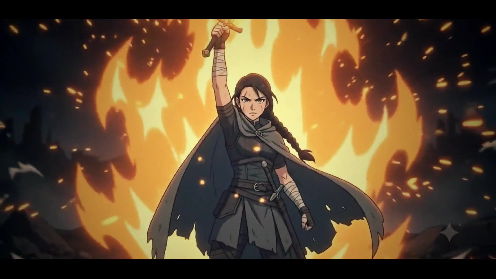

# EMBER VOW — an AI-made anime short film

**A ~1-minute cel-shaded anime teaser, generated shot-by-shot with AI and cut like a film.**
The real question behind it: *can today's AI hold a single character consistent across 14
independent shots — enough to make something that reads as one film, not fourteen clips?*

<!-- ═══════════════════════════════════════════════════════════════════════════
     ▶️  MAKE THE FILM PLAY INLINE (one-time, ~30 seconds, on GitHub web)
     1. Open this README on GitHub → click the ✏️ pencil (Edit).
     2. Put the cursor on the EMPTY line just below this comment.
     3. Drag  assets/full_vedio/Ember_Vow.mp4  from your computer into the editor.
        GitHub uploads it and inserts a  https://github.com/user-attachments/assets/…  link.
     4. That link renders as a VIDEO PLAYER automatically. Commit.
     5. (Optional) delete the poster block below so the player is the first thing seen.
     ═══════════════════════════════════════════════════════════════════════════ -->


<p align="center">
  
  <br/>
  <em>16:9 · cinemascope · cel-shaded anime · ~1 min &nbsp;·&nbsp; <b><a href="assets/full_vedio/Ember_Vow.mp4">▶ download the film</a></b></em>
</p>

---

## What this is

A structured experiment, run by an AI-tools researcher (not an animator), to see how far a
non-artist can get making an animated short using only AI plus a video editor. The story was
**deliberately designed around what generative video does well and away from what it fails at**
(see [findings](#what-we-learned)): one lone character, elemental/energy VFX instead of physical
combat, and a "power awakening" arc — because *character continuity across shots* and *physical
impact* are the two things these models are worst at.

- **Model (video):** Google Flow — *Omni Flash* (image-to-video)
- **Model (images):** Gemini (character sheet + per-shot stills)
- **Edit / finishing:** ffmpeg (grade, letterbox, film grain, vignette, captions, transitions)
- **Length:** ~1 min · **Shots:** 14 × ~4s · **Aspect:** 16:9, cinemascope letterbox

---

## The character

Everything hinges on one thing: a **locked character sheet**. Because the model has no memory
between shots, this single reference image is attached to *every* generation to keep Yura the same
person throughout. It's the biggest lever for consistency in the whole project.

<p align="center">
  
</p>

<details>
<summary><b>The exact prompt used to generate the character sheet</b> (click to expand)</summary>

> Create a clean anime character turnaround sheet for a single 2D cel-shaded anime character,
> hand-drawn line work.
>
> The character is Yura, a lean adult female warrior, mid-20s, weathered and battle-worn. Dark hair
> in a single long braid tied with one red cord, a pale scar cutting through her left eyebrow, sharp
> amber eyes, calm guarded expression.
>
> Outfit: a weathered grey-blue hooded traveling cloak worn open over dark fitted armor wraps and
> leather straps, cloth bindings on the forearms, worn boots. One plain straight sword in a dark
> sheath at her hip. Muted cold colour palette — grey-blue, charcoal, dark leather — with the single
> red hair cord as the only warm accent.
>
> Show the exact same character in full body from four angles: front view, 3/4 view, side profile,
> and back view. Above them, include an expression row of the same face showing five clearly distinct
> emotions: neutral calm, guarded wariness, fierce determination (open mouth, shouting), wide-eyed
> surprise, and a faint quiet smile.
>
> Keep facial proportions, hairstyle, braid, scar, eye colour, outfit, colours, and body proportions
> completely identical across every panel. Clean model-sheet presentation, evenly lit, neutral pale
> grey studio background, no scene elements, no props other than the sword, no extra characters, high
> detail.

All prompts (character sheet, the 14 shot stills, and the image-to-video prompts) live in
[`prompts/`](prompts/).
</details>

---

## How it was made (reproducible pipeline)

```
1. Study references + gather prompting skills   → skills/
2. Write a 1-minute, 14-shot script             → SCRIPT.md
3. Generate the character sheet (Gemini)         → prompts/01_character_sheet.md
4. Generate 14 shot stills (Gemini)              → prompts/02_shot_stills.md
   - attach the character sheet to EVERY still
5. Animate each still into a ~4s clip            → prompts/03_video_pilot.md
   (Omni Flash, image-to-video, "Frames" mode)     prompts/04_video_shots_04to14.md
6. Cut + finish in one edit pass (ffmpeg)        → assets/full_vedio/Ember_Vow.mp4
   - color grade, cinemascope letterbox, film grain, vignette
   - caption cards, dip-to-black act breaks, open/close fades
```

Every prompt in this repo was written from the reusable prompting **skills** in
[`skills/`](skills/) — so the process is repeatable, not one-off.

---

## What we learned

The honest findings (full write-ups in [`Report/`](Report/)):

- **A locked character sheet dramatically reduces identity drift.** Prior black-box testing rated
  shot-to-shot character continuity a flat "no-go" — but attaching one vetted reference image to
  every shot recovered it enough that Yura reads as the same person in ~12 of 14 shots.
- **Animate pre-vetted stills *separately* — don't batch.** A pilot ([Report/analyses](Report/analyses/pilot_method_A_vs_B.md))
  compared 3 separate image-to-video clips vs. one batched timecoded generation. Separate won
  decisively: batching was non-deterministic (dropped a directed beat, drifted the eyes) and threw
  away the vetted stills.
- **Drift lives in the details.** Where it broke, it broke small — a face hardening mid-clip, a
  scar changing sides, an ending glow fading the wrong way. Close-ups under heavy effects are the
  highest-risk shots.
- **The "film look" is a finishing pass, not the raw clips.** Color grade + letterbox + grain +
  vignette is what turns "AI clips" into "film footage" — more than any transition.

---

## Repo structure

```
SCRIPT.md                      the 1-minute, 14-shot script + why each choice
prompts/                       every prompt used (character sheet, stills, video)
skills/                        reusable AI prompting skills this was built from
assets/
  image-scene/                 character sheet + 14 shot stills (.png)
  vedio_clips/                 14 generated ~4s clips (.mp4)
  full_vedio/Ember_Vow.mp4     ← the finished film
Report/                        findings, analyses, and the capability report
reference/                     study material (see note below)
```

---

## Tools & credits

- **Google Flow / Omni Flash** — image-to-video generation
- **Gemini** — image generation (character sheet + stills)
- **ffmpeg** — editing and cinematic finishing
- Prompting skills adapted from open-source work (see each folder in [`skills/`](skills/) for its
  source and license) plus an original VFX-capability study in [`Report/`](Report/).

> **Note on `reference/`:** those clips are third-party copyrighted material studied only as visual
> reference. They are not part of the work and should not be redistributed — consider excluding that
> folder before making the repo public.

---

*Made as an AI capability experiment. The interesting result isn't that it's perfect — it's* where *it
holds and* where *it drifts.*
